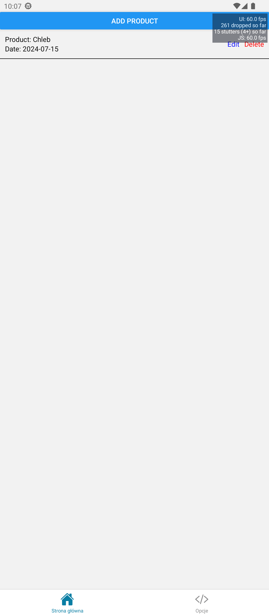
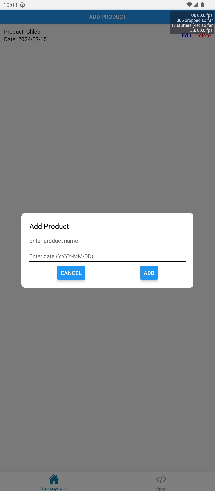
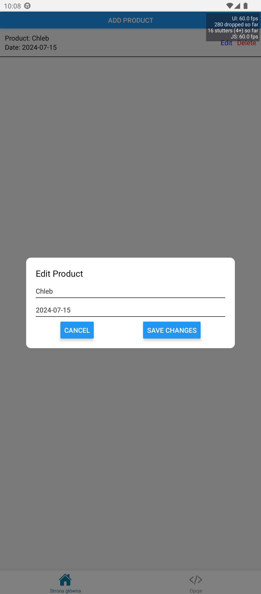

# React-Native Reminder App

This is an project created with [`create-expo-app`](https://www.npmjs.com/package/create-expo-app).

## Get started

1. Install dependencies

   ```bash
   npm install
   ```

2. Start the app

   ```bash
    npx expo start
   ```

In the output, you'll find options to open the app in a

- [development build](https://docs.expo.dev/develop/development-builds/introduction/)
- [Android emulator](https://docs.expo.dev/workflow/android-studio-emulator/)
- [iOS simulator](https://docs.expo.dev/workflow/ios-simulator/)
- [Expo Go](https://expo.dev/go), a limited sandbox for trying out app development with Expo


## About project
An application written in React-Native, used to send reminders about various things, with data saved in the device's memory. Notifications are sent a day before. In the future, a configuration will be available to set the frequency of notification

<p align="center">
  <br>
Main page
</p>
<p align="center">
  <br>
  Add product
</p>
<p align="center">
  <br>
EditProduct
</p>
